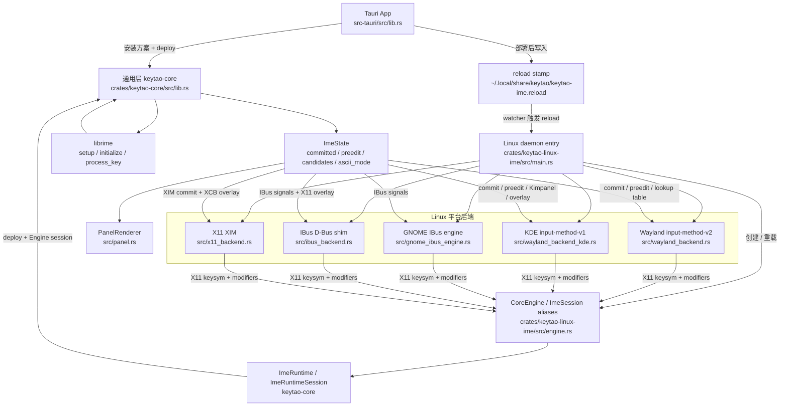

# keytao-linux-ime

`keytao-linux-ime` 是 KeyTao 的 Linux 系统输入法 daemon。它不依赖 Fcitx5 进程，自己接入 Wayland、KDE、GNOME IBus、X11 XIM 和 IBus 兼容 D-Bus 路径。

跨平台通用契约先看 [输入法通用层实现规范](../../docs/ime-common-layer.md)，完整 Linux 实现细节看 [IMPL.md](IMPL.md)。

## 当前实现逻辑

Linux 入口是 `src/main.rs`：

1. 解析 `--backend=wayland,xim,ibus`、`--ibus-engine`、`--version` 等参数。
2. 初始化 `/tmp/keytao-ime.log` 滚动日志。
3. 创建 `CoreEngine`，也就是 `keytao_core::ImeRuntime` 的 Linux 侧别名，调用 `engine.init()` 初始化和部署 librime。
4. 启动 reload watcher，监听 `~/.local/share/keytao/keytao-ime.reload`。
5. 根据 `WAYLAND_SOCKET`、`WAYLAND_DISPLAY`、`DISPLAY`、`XDG_CURRENT_DESKTOP` 选择后端。
6. 为每个输入上下文创建独立 `ImeSession`，把平台按键转成 X11 keysym + Rime modifier mask。
7. 调用通用层 `process_key_result()`，再把 `ImeState` 映射回平台提交、preedit 和候选 UI。

## 通用层与 librime 位置

- Linux 平台编排：`crates/keytao-linux-ime/src/main.rs`
- Linux runtime alias：`crates/keytao-linux-ime/src/engine.rs`
- 通用 librime runtime/wrapper：`crates/keytao-core/src/lib.rs`
- `ImeState` / `Candidate` / `KeyProcessResult`：`crates/keytao-core/src/lib.rs`
- librime 调用点：`keytao_core::deploy()` 里的 `setup()`、`initialize()`、`full_deploy_and_wait()`，以及 `Engine::process_key_result()` 里的 `session.process_key(KeyEvent::new(...))`
- 候选窗像素渲染：`crates/keytao-linux-ime/src/panel.rs`

Linux 后端只是系统协议 adapter：它们把 Wayland/XIM/IBus/KDE/GNOME 的事件统一成 X11 keysym + Rime modifier mask，再调用 `ImeSession`。真正的 librime deploy、session refresh 和 state extraction 都在 `keytao-core`。

## Mermaid 简图



## 后端职责

| 后端 | 文件 | 职责 |
| --- | --- | --- |
| Wayland input-method-v2 | `src/wayland_backend.rs` | wlroots/非 KDE Wayland，keyboard grab、virtual keyboard 转发、popup surface 候选窗 |
| KDE input-method-v1 | `src/wayland_backend_kde.rs` | KWin 私有虚拟键盘进程，input panel overlay，Kimpanel/impanel2 候选服务 |
| GNOME IBus engine | `src/gnome_ibus_engine.rs` | 连接现有 `ibus-daemon`，注册 KeyTao engine，发送 IBus preedit/lookup table signals |
| IBus D-Bus shim | `src/ibus_backend.rs` | 给 Chromium/CEF/Electron 等 IBus 客户端提供轻量兼容服务 |
| X11 XIM | `src/x11_backend.rs` | 注册 `@im=keytao`，处理 XIM input context，使用 XCB overlay 显示候选 |
| Candidate renderer | `src/panel.rs` | 消费 `keytao-theme` 的主题/model，并用 FreeType + tiny-skia 渲染 BGRA buffer |

## 数据流

```text
native key event
  -> platform backend
  -> X11 keysym + Rime modifier mask
  -> ImeRuntimeSession::process_key_result()
  -> keytao-core::Engine
  -> librime session.process_key()
  -> ImeState
  -> platform commit/preedit/candidate adapter
```

## 运行与排查

```sh
keytao-ime --version
keytao-ime --backend=wayland,xim,ibus
pgrep -af keytao-ime
tail -f /tmp/keytao-ime.log
```

正式发行走仓库根目录的 `scripts/build-linux.sh`，产物是 deb、rpm 和 tar.gz，不产出 AppImage。发行包内置 `runtime/`，包含 `librime`、OpenCC 数据、`rime-plugins` 和基础 `rime-data`。

KDE 原生 Wayland 由 App 写入 `~/.local/share/applications/keytao-wayland-launcher.desktop` 并配置 `kwinrc [Wayland] InputMethod=keytao-wayland-launcher.desktop`。普通 daemon 仍负责 XIM/IBus fallback；KWin 私有进程只负责 KDE 原生 Wayland 输入法槽位。
