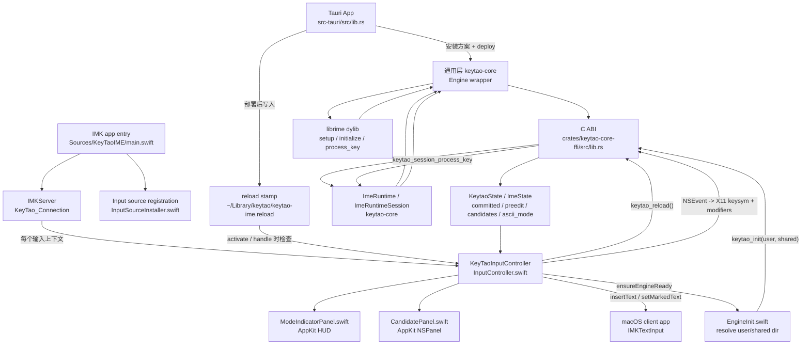

# keytao-macos-ime

`keytao-macos-ime` 是 KeyTao 的 macOS IMKit 系统输入法 bundle。它安装到 `/Library/Input Methods/KeyTao.app`，由 macOS 按需启动，并通过 `keytao-core-ffi` 接入通用 librime 层。

跨平台通用契约先看 [输入法通用层实现规范](../../docs/ime-common-layer.md)，完整 macOS 实现细节看 [IMPL.md](IMPL.md)。

## 当前实现逻辑

macOS 入口是 `Sources/KeyTaoIME/main.swift`：

1. 处理输入源注册命令，例如 `--register-input-source`、`--enable-input-source`、`--select-input-source`。
2. 正常启动时创建 `IMKServer`，设置 `NSApplication` 为 accessory app 并进入 run loop。
3. macOS 为每个输入上下文创建 `KeyTaoInputController`。
4. controller 初始化时调用 `ensureEngineReady()`，底层通过 `keytao_init(userDir, sharedDir)` 部署并初始化 librime。
5. 每个 controller 创建独立 `keytao_create_session()`。
6. `handle(_:client:)` 把 `NSEvent` 转成 X11 keysym + Rime modifier mask，调用 `keytao_session_process_key()`。
7. FFI 返回 `KeytaoState`，controller 再按顺序提交 `committed`、设置 marked text、更新候选窗和中英模式。
8. App 部署后写 `~/Library/keytao/keytao-ime.reload`，输入法在激活或按键时发现变化，调用 `keytao_reload()`，由通用 runtime 刷新 session。

## 通用层与 librime 位置

- macOS IMK 入口：`crates/keytao-macos-ime/Sources/KeyTaoIME/main.swift`
- engine 初始化和目录解析：`Sources/KeyTaoIME/EngineInit.swift`
- 按键、preedit、候选状态应用：`Sources/KeyTaoIME/InputController.swift`
- AppKit 候选窗：`Sources/KeyTaoIME/CandidatePanel.swift`
- AppKit 模式提示：`Sources/KeyTaoIME/ModeIndicatorPanel.swift`
- C FFI：`crates/keytao-core-ffi/src/lib.rs`，per-session API 复用 `ImeRuntimeSession`
- 通用 librime runtime/wrapper：`crates/keytao-core/src/lib.rs`
- librime 调用点：`keytao_core::deploy()` 里的 `setup()`、`initialize()`、`full_deploy_and_wait()`，以及 `Engine::process_key_result()` 里的 `session.process_key(KeyEvent::new(...))`

macOS IMK 层只是 AppKit/InputMethodKit adapter：Swift 通过 FFI 创建 session、发送 X11 keysym + Rime modifier mask、接收 `KeytaoState`，不直接访问 librime context/menu/status。

## Mermaid 简图



## 平台职责

| 模块 | 文件 | 职责 |
| --- | --- | --- |
| IMK 入口 | `Sources/KeyTaoIME/main.swift` | 命令行注册入口、创建 `IMKServer`、启动 accessory run loop |
| 输入源管理 | `Sources/KeyTaoIME/InputSourceInstaller.swift` | TIS 注册、启用、选择、禁用旧输入源 |
| engine 初始化 | `Sources/KeyTaoIME/EngineInit.swift` | 解析用户目录/共享目录、调用 FFI 初始化、检查 reload stamp |
| 输入控制器 | `Sources/KeyTaoIME/InputController.swift` | 按键转换、session 生命周期、提交文本、marked text、候选选择、Shift 切换 |
| 主题 | `Sources/KeyTaoIME/ImeTheme.swift` | 通过 `keytao-core-ffi` 读取通用主题 JSON，输出候选窗/模式提示样式 |
| 候选窗 | `Sources/KeyTaoIME/CandidatePanel.swift` | AppKit `NSPanel` 候选展示、点击选词、翻页按钮、主题渲染 |
| 模式提示 | `Sources/KeyTaoIME/ModeIndicatorPanel.swift` | 中/英提示和主题渲染 |
| FFI | `crates/keytao-core-ffi/src/lib.rs` | 给 Swift 暴露 per-session C ABI，并复用 `ImeRuntimeSession` |
| 通用层 | `crates/keytao-core/src/lib.rs` | librime deploy/runtime/session/state wrapper |

## 数据流

```text
NSEvent
  -> KeyTaoInputController
  -> X11 keysym + Rime modifier mask
  -> keytao_session_process_key()
  -> keytao-core::ImeRuntimeSession
  -> keytao-core::Engine
  -> librime session.process_key()
  -> KeytaoState
  -> insertText / setMarkedText / CandidatePanel / ModeIndicatorPanel
```

## 主题配置

macOS IME 的候选窗和中英模式提示已经接入配置文件主题：

- 内置默认主题：`crates/keytao-theme/default-theme.yaml`，构建后位于 bundle 的 `Contents/Resources/default-theme.yaml`
- 用户覆盖主题：`~/Library/keytao/theme.yaml`
- 开发调试覆盖：`KEYTAO_IME_THEME_PATH=/path/to/theme.yaml`

用户主题只需要写要覆盖的字段；输入法会调用 Rust 通用主题层先加载内置默认主题，再覆盖用户配置并输出 normalized JSON。主题支持候选窗横向/纵向、背景色、圆角、边框、阴影、padding、gap、字号、字体、候选项选中/hover/comment/label 颜色、翻页按钮、中英模式提示尺寸和持续时间。主题文件变更后，下次候选窗或模式提示刷新会重新读取。

竖排示例：

```yaml
panel:
  orientation: vertical
  maxWidth: 320
candidate:
  maxWidth: 280
  separatorVisible: true
font:
  size: 19
```

## 构建与排查

完整 macOS 发行包从仓库根目录构建：

```sh
pnpm install
pnpm build:macos
scripts/verify-macos-pkg.sh target/keytao-macos-pkg/KeyTao.pkg
```

产物：

- `target/keytao-macos-pkg/KeyTao.pkg`
- GitHub Release 中会重命名为 `keytao-app-<version>-macos-<arch>.pkg`，例如 `macos-arm64` 或 `macos-x86_64`

测试安装：

```sh
sudo installer -pkg target/keytao-macos-pkg/KeyTao.pkg -target /
test -d "/Applications/KeyTao.app"
test -x "/Library/Input Methods/KeyTao.app/Contents/MacOS/KeyTaoIME"
"/Library/Input Methods/KeyTao.app/Contents/MacOS/KeyTaoIME" --list-input-sources
open -a KeyTao
```

如果只是单独调试输入法 bundle，可以继续使用开发脚本：

```sh
crates/keytao-macos-ime/build.sh --skip-pkg
crates/keytao-macos-ime/install.sh --release
```

正式发行走仓库根目录的 `scripts/build-macos.sh`，产物是 pkg，不产出 dmg。pkg 同时安装主 App 和系统输入法 bundle，并保证两者都带完整 `librime`、OpenCC 数据、`rime-plugins` 和基础 `rime-data`。

常用路径：

- 输入法 bundle：`/Library/Input Methods/KeyTao.app`
- 用户数据目录：`~/Library/keytao`
- 用户主题：`~/Library/keytao/theme.yaml`
- reload stamp：`~/Library/keytao/keytao-ime.reload`
- bundle id：`ink.rea.inputmethod.keytao`
- 主输入源 id：`ink.rea.inputmethod.keytao.Hans`
